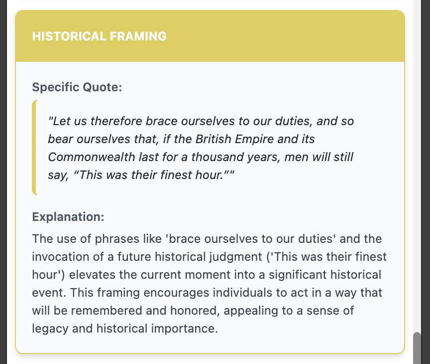

# HootSpot AI Text Analyzer


**HootSpot is a Chrome Extension that uses the Google Gemini API to help you identify and understand a wide range of psychological, rhetorical, and political manipulation tactics in any text.**

I started building this extension frustrated by the level of information manipulation in news articles and political statements.

Initially, I was relying on a 'Dictionary of Rhetorical Manipulation' that I had assembled myself. But it turned out, a more non-deterministic system gave much richer results with more convincing reasoning. Rhetorical tactics can be found in about any text intended to convince or sway a reader, regardless of the topic.

[](https://react.dev/)
[](https://www.typescriptlang.org/)
[](https://vitejs.dev/)
[](https://tailwindcss.com/)
[](https://d3js.org/)
[](https://opensource.org/licenses/MIT)

HootSpot runs as a "side panel" in your browser, allowing you to select text from any webpage or paste it directly to receive an instant, in-depth analysis of its underlying messaging and potential manipulative techniques. Your API key and data are stored locally, ensuring your privacy.

---

## Key Features

*   **Advanced Rhetorical Analysis**: Leverages the area of expertise of any great LLM: Being trained on a vast variety of texts, and a deep understanding of written communication patterns.
*   **Interactive Visualization**: Generates a dynamic bubble chart using **D3.js** to visualize the strength, frequency, and categories of detected tactics, providing an immediate "Manipulation Profile" of the text.
*   **Comprehensive & Actionable Reports**: Outputs a report including an AI-generated summary, color-coded highlights in the source text, and detailed card-based explanations for each detected pattern.
*   **Export and Save Findings**: Easily save your analysis. Download a PDF report, including highlights and the visual bubble chart. You can also export the raw analysis as a JSON file and load it back into the extension later.
*   **Seamless Context Menu & Keyboard Integration**: Right-click any selected text to instantly send it to the HootSpot side panel for analysis, replacement, or appending. For even faster workflow, use keyboard shortcuts (`Alt+Shift+A`, `Alt+Shift+S`, `Alt+Shift+D`) to perform these actions without clicking.
*   **Flexible AI Model Selection**: Choose from a list of Google Gemini models that are automatically fetched and updated. Models are conveniently grouped into "Stable" and "Preview" categories, allowing you to balance speed, cost, and analytical power.
*   **Privacy-First & Customizable**: Your API key and custom settings are stored securely and locally in your browser's `localStorage`. Configure your experience by setting a custom character limit for analysis to manage API usage and costs.
*   **Full Internationalization (i18n)**: The user interface is available in English, German, French, and Spanish out of the box.
*   **AI-Powered Language Management**: A unique feature that allows you to use the Gemini API to translate the extension's entire interface into any language. Simply provide a language code (e.g., "it" for Italian), and the AI generates the necessary translation files.

## Demo / Examples


**Their Finest Hour by Winston Churchill**
**I Am Prepared to Die by Nelson Mandela**
**Donald Trump’s address to nation after attack on Iran**

<details>
  <summary>**Their Finest Hour by Winston Churchill**</summary>
  <br>

  *Analysis and Visualization*

  
  

  *Highlighted Text*

  

  *Found Patterns*

  
  
  
  
  
  
</details>

  ---

  **I Am Prepared to Die by Nelson Mandela**

  *Analysis and Visualization*

  

  *Highlighted Text*

  

  ---

  **Donald Trump’s address to nation after attack on Iran**

  *Analysis and Visualization*

  

  *Highlighted Text*

  

</details>


## How It Works

HootSpot is built as a modern Manifest V3 Chrome Extension, ensuring security and performance.

1.  **Input**: A user selects text and uses the context menu or pastes text directly into the side panel.
2.  **Request**: The `background.ts` service worker or the UI (`App.tsx`) sends the user's text and the core `SYSTEM_PROMPT` to the Google Gemini API via `geminiService.ts`.
3.  **Analysis**: The Gemini API acts as an expert in linguistics and psychology. It analyzes the text for manipulative patterns and returns a structured JSON response.
4.  **Response Handling**: The `geminiService.ts` includes robust logic to parse the API's response, including extracting JSON from markdown code blocks to handle various model outputs gracefully.
5.  **Rendering**: The React frontend (`App.tsx`) processes this JSON and renders an interactive, multi-part report in the side panel, featuring the summary, the D3.js bubble chart (`ManipulationBubbleChart.tsx`), and the highlighted source text.
6.  **PDF Generation**: For PDF exports, the app uses a sandboxed `iframe` (`pdf-generator.html`) for security. It renders an off-screen, high-resolution version of the bubble chart using `html2canvas` and constructs the PDF with `@react-pdf/renderer` in the sandbox, preventing direct access to sensitive resources.

## Installation and Usage

### For Users (Recommended)

The easiest way to use HootSpot AI is to install it from the Chrome Web Store.

> **[Install from the Chrome Web Store](https://chrome.google.com/webstore/category/extensions)** (Link pending publication)

### For Developers (Running Locally)

If you want to run the project locally for development or testing, follow these steps:

1.  **Clone the Repository**
    ```bash
    git clone https://github.com/rurounigit/hootspot.git
    cd hootspot
    ```

2.  **Install Dependencies**
    ```bash
    npm install
    ```

3.  **Build the Extension**
    ```bash
    npm run build
    ```
    This will create a `dist` directory containing the production-ready extension files.

4.  **Load the Extension in Chrome**
    *   Open Google Chrome and navigate to `chrome://extensions`.
    *   Enable **"Developer mode"** using the toggle in the top-right corner.
    *   Click the **"Load unpacked"** button.
    *   Select the `dist` directory that was created in the previous step.
    *   The HootSpot AI icon should now appear in your Chrome toolbar.

## Getting Started

1.  **First-Time Setup: Configure your API Key**
    *   Click the **HootSpot AI icon** in your Chrome toolbar to open the side panel.
    *   Expand the **"Configuration"** section.
    *   You'll need a Google Gemini API key. You can get one for free from **[Google AI Studio](https://aistudio.google.com/app/apikey)**.
    *   Paste your key into the API key input field and click **"Save & Test Configuration"**. The extension will validate the key. This is a one-time setup.

2.  **Analyze Text from Any Webpage (Recommended Workflow)**
    *   Highlight any text on a webpage.
    *   Right-click the selected text.
    *   Choose **"Analyze selected text with HootSpot"** from the context menu.
    *   The side panel will open and automatically begin the analysis.

3.  **Send Text to the Panel**
    *   You can also right-click selected text and choose **"Copy text to HootSpot"** to replace the content in the panel or **"Add selected text to HootSpot"** to append it to the existing text.

4.  **Analyze Text Manually**
    *   Open the side panel by clicking the HootSpot icon.
    *   Paste any text you want to analyze into the text area.
    *   Click **"Analyze"**.

5.  **Review the Report**
    *   Scroll down to review the generated report, complete with a visual profile, highlights, and detailed explanations.

## Directory Structure

The project is structured to be clean and maintainable:

```
/
├── dist/                  # Built extension files (output of `npm run build`)
├── public/                # Static assets, manifest.json, and locales
│   ├── _locales/          # i18n message files for different languages
│   └── manifest.json      # Core Chrome Extension configuration
├── src/                   # Main application source code
│   ├── components/        # Reusable React components
│   ├── hooks/             # Custom React hooks (e.g., `useModels.ts`)
│   ├── locales/           # English-language JSON strings for i18n
│   ├── services/          # API communication logic (e.g., `geminiService.ts`)
│   ├── utils/             # Helper functions (e.g., text manipulation)
│   ├── App.tsx            # Main React application component
│   ├── background.ts      # Extension service worker (context menus, etc.)
│   ├── i18n.tsx           # Internationalization setup
│   ├── index.tsx          # React entry point
│   ├── pdf-generator.tsx  # React code for the sandboxed PDF page
│   └── types.ts           # TypeScript type definitions
├── package.json           # Project dependencies and scripts
└── vite.config.ts         # Vite build configuration
```

## Tech Stack

*   **Framework**: [React](https://react.dev/) 19
*   **Language**: [TypeScript](https://www.typescriptlang.org/)
*   **Build Tool**: [Vite](https://vitejs.dev/)
*   **Platform**: [Chrome Extension (Manifest V3)](https://developer.chrome.com/docs/extensions)
*   **AI**: [Google Gemini API](https://ai.google.dev/) (via `@google/genai`)
*   **Styling**: [Tailwind CSS](https://tailwindcss.com/)
*   **Charting**: [D3.js](https://d3js.org/)
*   **PDF Generation**: [@react-pdf/renderer](https://react-pdf.org/) & [html2canvas](https://html2canvas.hertzen.com/)
*   **Internationalization**: Custom i18n provider (`src/i18n.tsx`)

## Contributing

Contributions are welcome! If you have suggestions for improving the system prompt, adding features, or fixing bugs, please feel free to open an issue or submit a pull request.

1.  Fork the repository.
2.  Create your feature branch (`git checkout -b feature/AmazingFeature`).
3.  Commit your changes (`git commit -m 'Add some AmazingFeature'`).
4.  Push to the branch (`git push origin feature/AmazingFeature`).
5.  Open a Pull Request.

## Disclaimer

This tool is intended for educational and analytical purposes. The analysis is generated by an AI and may not always be perfectly accurate or complete. The user is **solely responsible for all costs** incurred from their use of the Google Gemini API.

## License

This project is licensed under the MIT License. See the [LICENSE](LICENSE) file for details.