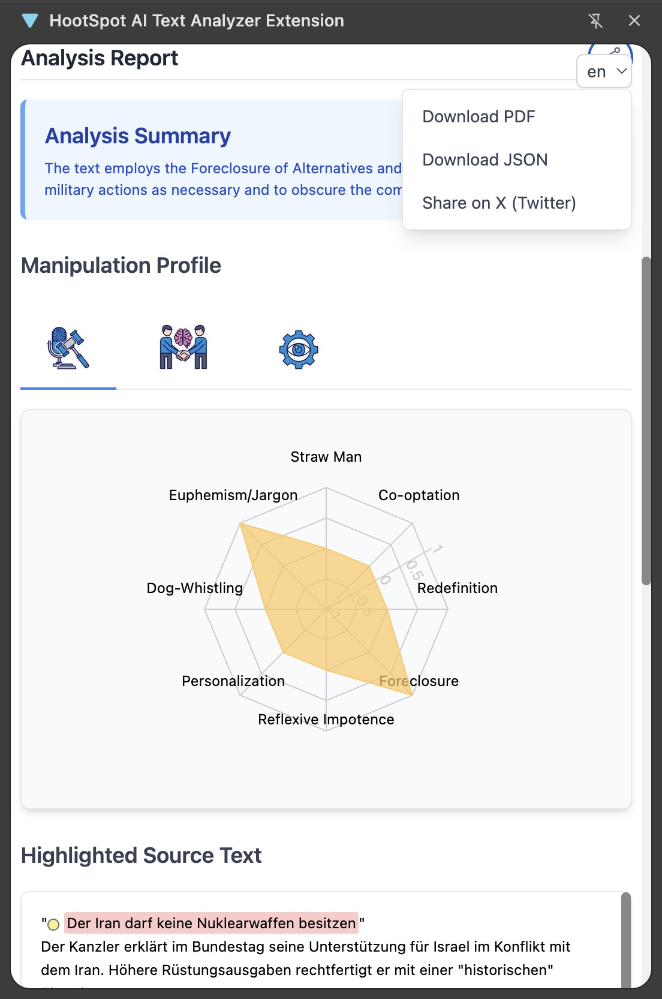

# HootSpot AI Text Analyzer


**HootSpot is a Chrome Extension designed to help you identify and explain a wide range of psychological, rhetorical, and political manipulation tactics.**

[](https://react.dev/)
[](https://www.typescriptlang.org/)
[](https://vitejs.dev/)
[](https://tailwindcss.com/)
[](https://recharts.org/)
[](https://opensource.org/licenses/MIT)

This tool acts as a "side panel" in your browser, allowing you to select text from any webpage or paste it directly to receive an instant, in-depth analysis of its underlying messaging and potential manipulative techniques.

---

## ✨ Key Features

*   **Advanced Rhetorical Analysis**: Leverages a comprehensive, built-in **"Analyst's Lexicon"** to detect over 20 distinct patterns of manipulation, from simple guilt-tripping to complex socio-political rhetoric.
*   **📊 Visual Manipulation Profile**: Instantly understand the nature of the text with a dynamic radar chart that visualizes the frequency and categories of detected manipulative tactics.
*   **📝 Detailed, Actionable Reports**: Provides a multi-faceted report including an AI-generated summary, color-coded highlights in the source text, and detailed explanations for each detected pattern.
*   **📥 Export and Share Reports**: Easily share your findings. Download a complete, professionally formatted PDF report, including highlights and visual charts. You can also export the raw analysis as a JSON file or share a brief summary directly to X (Twitter).
*   **Seamless Context Menu Integration**: Right-click any selected text on a webpage to instantly send it to the HootSpot side panel. Choose to simply copy the text or to trigger an immediate analysis, streamlining your workflow.
*   **⚙️ Flexible AI Model Selection**: Choose from a list of Google Gemini models that are automatically fetched and updated. Models are conveniently grouped into "Stable" and "Preview" categories, allowing you to tailor the analysis to your needs—from fast, lightweight models to more powerful, nuanced ones.
*   **Privacy-Focused & Customizable**: Your API key and custom settings are stored securely and locally in your browser. Configure your experience by setting a custom character limit for analysis to manage API usage.
*   **Multi-language Support**: The user interface is available in English, German, French, and Spanish out of the box.
*   **🤖 AI-Powered Language Management**: A unique feature that allows you to use the AI to translate the extension's entire interface into any language. Simply provide a language code (e.g., "it" for Italian), and the AI handles the rest.

## 📸 Demo



## 🔬 How It Works

The core of HootSpot is the **`ANALYST_LEXICON`**, a detailed, multi-section prompt that provides the AI with a framework for understanding manipulative language. This lexicon is an integral part of the system prompt sent to the Google Gemini API.

1.  When you submit a text for analysis (either by right-clicking or pasting), the extension sends it to the Google Gemini API along with the system prompt.
2.  This instructs the AI to act as an expert in linguistics, psychology, and rhetoric, and to use the lexicon to find matching patterns in your text.
3.  The Gemini API returns a structured JSON response containing the analysis.
4.  The extension parses this JSON and renders an interactive, multi-part report in the side panel, including the summary, visual chart, and highlighted text.

## 🛠️ Installation and Usage

### For Users (Recommended)

The easiest way to use HootSpot AI is to install it from the Chrome Web Store.

> **[🔗 Install from the Chrome Web Store](https://chrome.google.com/webstore/detail/your-extension-id)** (Link pending publication)

### For Developers (Running Locally)

If you want to run the project locally for development or testing, follow these steps:

1.  **Clone the Repository**
    ```bash
    git clone https://github.com/rurounigit/hootspot.git
    cd hootspot
    ```

2.  **Install Dependencies**
    ```bash
    npm install
    ```

3.  **Build the Extension**
    ```bash
    npm run build
    ```
    This will create a `dist` directory containing the production-ready extension files.

4.  **Load the Extension in Chrome**
    *   Open Google Chrome and navigate to `chrome://extensions`.
    *   Enable **"Developer mode"** using the toggle in the top-right corner.
    *   Click the **"Load unpacked"** button.
    *   Select the `dist` directory that was created in the previous step.
    *   The HootSpot AI Text Analyzer icon should now appear in your Chrome toolbar.

## 🚀 Getting Started

1.  **First-Time Setup: Configure your API Key**
    *   Click the **HootSpot AI icon** in your Chrome toolbar to open the side panel.
    *   Expand the **"Configuration"** section.
    *   You'll need a Google Gemini API key. You can get one for free from **[Google AI Studio](https://aistudio.google.com/app/apikey)**.
    *   Paste your key into the API key input field and click **"Save & Test Configuration"**. The extension will validate the key. This is a one-time setup.

2.  **Analyze Text from Any Webpage (Recommended Workflow)**
    *   Highlight any text on a webpage.
    *   Right-click the selected text.
    *   Choose **"Analyze selected text with HootSpot"** from the context menu.
    *   The side panel will open and automatically begin the analysis.

3.  **Analyze Text Manually**
    *   Open the side panel by clicking the HootSpot icon.
    *   Paste any text you want to analyze into the text area.
    *   Click **"Analyze Text"**.

4.  **Review the Report**
    *   Scroll down to review the generated report, complete with a visual profile, highlights, and explanations.

## 📖 The Analyst's Lexicon

HootSpot identifies patterns based on a detailed lexicon, which is categorized into three main sections. Each pattern is meticulously defined, complete with telltale signs and illustrative examples.

*   **Section 1: Interpersonal & Psychological Manipulation Tactics**
    *   *(e.g., Gaslighting, Guilt Tripping, Love Bombing, DARVO)*
*   **Section 2: Covert Aggression & Indirect Control**
    *   *(e.g., The Backhanded Compliment, Weaponized Incompetence, The Silent Treatment)*
*   **Section 3: Sociopolitical & Rhetorical Mechanisms of Control**
    *   *(e.g., The Straw Man Fallacy, The Co-optation of Dissent, Redefining the Terrain, Euphemism & Jargon)*

## 💻 Tech Stack

*   **Framework**: [React](https://react.dev/)
*   **Language**: [TypeScript](https://www.typescriptlang.org/)
*   **Build Tool**: [Vite](https://vitejs.dev/)
*   **Styling**: [Tailwind CSS](https://tailwindcss.com/)
*   **Charting**: [Recharts](https://recharts.org/)
*   **AI**: [Google Gemini API](https://ai.google.dev/)
*   **Platform**: [Chrome Extension (Manifest V3)](https://developer.chrome.com/docs/extensions)

## 🤝 Contributing

Contributions are welcome! If you have suggestions for improving the lexicon, adding features, or fixing bugs, please feel free to open an issue or submit a pull request.

1.  Fork the repository.
2.  Create your feature branch (`git checkout -b feature/AmazingFeature`).
3.  Commit your changes (`git commit -m 'Add some AmazingFeature'`).
4.  Push to the branch (`git push origin feature/AmazingFeature`).
5.  Open a Pull Request.

## ⚠️ Disclaimer

This tool is intended for educational and analytical purposes. The analysis is generated by an AI and may not always be perfectly accurate or complete. The user is **solely responsible for all costs** incurred from their use of the Google Gemini API.

## 📄 License

This project is licensed under the MIT License.