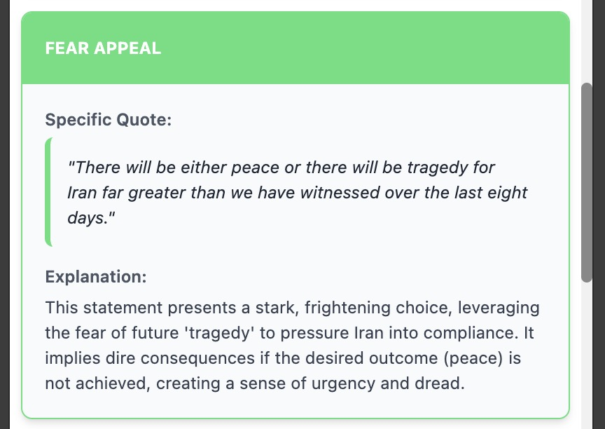

# HootSpot AI Text Analyzer


**HootSpot is a Chrome Extension that empowers you to identify and understand a wide range of psychological, rhetorical, and political manipulation tactics in any text, leveraging the power of Google Gemini API or your own local Language Models via LM Studio.**

**It runs as a "side panel" in your browser, allowing you to select text from any webpage or paste it directly to receive an instant, in-depth analysis of its underlying messaging and potential manipulative techniques. Your API key and local server configurations are stored locally, ensuring your privacy.**

I started building this extension frustrated by the level of information manipulation in news articles and political statements.

Initially, I was relying on a 'Dictionary of Rhetorical Manipulation' that I had assembled myself. But it turned out, a more non-deterministic system gave much richer results with more convincing reasoning. Rhetorical tactics as it turns out can be found in about any text intended to convince or sway a reader, regardless of political affiliation or topic.

[](https://react.dev/)
[](https://www.typescriptlang.org/)
[](https://vitejs.dev/)
[](https://tailwindcss.com/)
[](https://d3js.org/)
[](https://opensource.org/licenses/MIT)

---

## Key Features

*   **Advanced Rhetorical Analysis**: Leverages the area of expertise of any great LLM: Being trained on a vast variety of texts, and a deep understanding of written communication patterns.
*   **Flexible AI Service Provider**: Choose between using the powerful **Google Gemini API** (cloud-based) or connecting to your own **local Language Models (LLMs)** running via an **LM Studio** server, giving you control over data privacy and computational resources.
*   **Interactive Visualization**: Generates a dynamic bubble chart using **D3.js** to visualize the strength, frequency, and categories of detected tactics, providing an immediate "Manipulation Profile" of the text.
*   **Comprehensive & Actionable Reports**: Outputs a report including an AI-generated summary, color-coded highlights in the source text, and detailed card-based explanations for each detected pattern.
*   **Export and Save Findings**: Easily save your analysis. Download a PDF report, including highlights and the visual bubble chart. You can also export the raw analysis as a JSON file and load it back into the extension later.
*   **Seamless Context Menu & Keyboard Integration**: Right-click any selected text to instantly send it to the HootSpot side panel for analysis, replacement, or appending. For even faster workflow, use keyboard shortcuts (`Alt+Shift+A`, `Alt+Shift+S`, `Alt+Shift+D`) to perform these actions without clicking.
*   **Flexible AI Model Selection**: When using Google Gemini, choose from a list of Google Gemini models that are automatically fetched and updated. Models are conveniently grouped into "Stable" and "Preview" categories, allowing you to balance speed, cost, and analytical power.
*   **Privacy-First & Customizable**: Your API key and custom settings are stored securely and locally in your browser's `localStorage`. Configure your experience by setting a custom character limit for analysis to manage API usage and costs.
*   **Full Internationalization (i18n)**: The user interface is available in English, German, French, and Spanish out of the box.
*   **AI-Powered Language Management**: A unique feature that allows you to use the Gemini API to translate the extension's entire interface into any language. Simply provide a language code (e.g., "it" for Italian), and the AI generates the necessary translation files.
*   **AI-Powered Rebuttals**: Generate concise counter-arguments to analyzed text, leveraging the AI's understanding of the original text's manipulative patterns (experimental feature).

## Demo


## Examples

**Their Finest Hour by Winston Churchill**

“What General Weygand called the Battle of France is over. I expect that the Battle of Britain is about to begin. Upon this battle depends the survival of Christian civilization. Upon it depends our own British life, and the long continuity of our institutions and our Empire. The whole fury and might of the enemy must very soon be turned on us. Hitler knows that he will have to break us in this Island or lose the war. If we can stand up to him, all Europe may be free and the life of the world may move forward into broad, sunlit uplands. But if we fail, then the whole world, including the United States, including all that we have known and cared for, will sink into the abyss of a new Dark Age made more sinister, and perhaps more protracted, by the lights of perverted science. Let us therefore brace ourselves to our duties, and so bear ourselves that, if the British Empire and its Commonwealth last for a thousand years, men will still say, “This was their finest hour.””

<details>
  <summary>Click to see the results</summary>
  <br>

  *Analysis and Visualization*

  
  
  <br><br>

  *Highlighted Text*

  
  <br><br>

  *Found Patterns*

  
  
  
  
  
</details>

  ---

**I Am Prepared to Die by Nelson Mandela**

“Above all, My Lord, we want equal political rights, because without them our disabilities will be permanent. I know this sounds revolutionary to the whites in this country, because the majority of voters will be Africans. This makes the white man fear democracy.

But this fear cannot be allowed to stand in the way of the only solution which will guarantee racial harmony and freedom for all. It is not true that the enfranchisement of all will result in racial domination. Political division, based on colour, is entirely artificial and, when it disappears, so will the domination of one colour group by another. The ANC has spent half a century fighting against racialism. When it triumphs as it certainly must, it will not change that policy.

This then is what the ANC is fighting. Our struggle is a truly national one. It is a struggle of the African people, inspired by our own suffering and our own experience. It is a struggle for the right to live.

During my lifetime I have dedicated my life to this struggle of the African people. I have fought against white domination, and I have fought against black domination. I have cherished the ideal of a democratic and free society in which all persons will live together in harmony and with equal opportunities. It is an ideal for which I hope to live for and to see realised. But, My Lord, if it needs be, it is an ideal for which I am prepared to die.”

<details>
  <summary>Click to see the results</summary>
  <br>

  *Analysis and Visualization*

  
  
  <br><br>

  *Highlighted Text*

  
  <br><br>

  *Found Patterns*

  
  
  
  
  
</details>

  ---

**Donald Trump’s address to nation after attack on Iran**

"A short time ago, the US military carried out massive precision strikes on the three key nuclear facilities in the Iranian regime: Fordow, Natanz and Isfahan. Everybody heard those names for years as they built this horribly destructive enterprise. Our objective was the destruction of Iran’s nuclear enrichment capacity and a stop to the nuclear threat posed by the world’s number one state sponsor of terror. Tonight, I can report to the world that the strikes were a spectacular military success. Iran’s key nuclear enrichment facilities have been completely and totally obliterated. Iran, the bully of the Middle East, must now make peace. If they do not, future attacks will be far greater and a lot easier. For 40 years, Iran has been saying, “Death to America, death to Israel”. They have been killing our people, blowing off their arms, blowing off their legs with roadside bombs – that was their speciality. We lost over a thousand people, and hundreds of thousands throughout the Middle East and around the world have died as a direct result of their hate, in particular, so many were killed by their general, Qassem Soleimani. I decided a long time ago that I would not let this happen. Sign up for Al Jazeera Americas Coverage Newsletter US politics, Canada’s multiculturalism, South America’s geopolitical rise—we bring you the stories that matter. E-mail address Subscribe By signing up, you agree to our Privacy Policy protected by reCAPTCHA It will not continue. I want to thank and congratulate Prime Minister Bibi Netanyahu. We worked as a team like perhaps no team has ever worked before, and we’ve gone a long way to erasing this horrible threat to Israel. I want to thank the Israeli military for the wonderful job they’ve done and, most importantly, I want to congratulate the great American patriots who flew those magnificent machines tonight, and all of the United States military on an operation the likes of which the world has not seen in many, many decades. Hopefully, we will no longer need their services in this capacity. I hope that’s so. I also want to congratulate the chairman of the Joint Chiefs of Staff, General Dan “Razin” Caine – spectacular general – and all of the brilliant military minds involved in this attack. With all of that being said, this cannot continue. There will be either peace or there will be tragedy for Iran far greater than we have witnessed over the last eight days. Remember, there are many targets left. Tonight’s was the most difficult of them all by far, and perhaps the most lethal, but if peace does not come quickly, we will go after those other targets with precision, speed and skill. Most of them can be taken out in a matter of minutes. There’s no military in the world that could have done what we did tonight, not even close. There has never been a military that could do what took place just a little while ago. Tomorrow, General Caine, Secretary of Defense Pete Hegseth, will have a press conference at 8am (12:00 GMT) at the Pentagon, and I want to just thank everybody, and in particular, God. I want to just say, “We love you, God, and we love our great military. Protect them.” God bless the Middle East. God bless Israel, and God bless America. Thank you very much. Thank you."

<details>
  <summary>Click to see the results</summary>
  <br>

  *Analysis and Visualization*

  
  
  <br><br>

  *Highlighted Text*

  
  <br><br>

  *Found Patterns*

  
  
  
  
  
  <br><br>

  *Rebuttal*

  
</details>

## How It Works

HootSpot is built as a modern Manifest V3 Chrome Extension, ensuring security and performance.

1.  **Input**: A user selects text and uses the context menu or pastes text directly into the side panel.
2.  **Request**: The `background.ts` service worker or the UI (`App.tsx`) sends the user's text and the core `SYSTEM_PROMPT` to the **selected AI service (Google Gemini API or a local LM Studio server)** via `geminiService.ts`.
3.  **Analysis**: The **AI model (from Google Gemini or LM Studio)** acts as an expert in linguistics and psychology. It analyzes the text for manipulative patterns and returns a structured JSON response.
4.  **Response Handling**: The `geminiService.ts` includes robust logic to parse the API's response, including extracting JSON from markdown code blocks to handle various model outputs gracefully.
5.  **Rendering**: The React frontend (`App.tsx`) processes this JSON and renders an interactive, multi-part report in the side panel, featuring the summary, the D3.js bubble chart (`ManipulationBubbleChart.tsx`), and the highlighted source text.
6.  **PDF Generation**: For PDF exports, the app uses a sandboxed `iframe` (`pdf-generator.html`) for security. It renders an off-screen, high-resolution version of the bubble chart using `html2canvas` and constructs the PDF with `@react-pdf/renderer` in the sandbox, preventing direct access to sensitive resources.

## Installation and Usage

### For Users (Recommended)

The easiest way to use HootSpot AI is to install it from the Chrome Web Store.

> **[Install from the Chrome Web Store](https://chrome.google.com/webstore/category/extensions)** (Link pending publication)

### For Developers (Running Locally)

If you want to run the project locally for development or testing, follow these steps:

1.  **Clone the Repository**
    ```bash
    git clone https://github.com/rurounigit/hootspot.git
    cd hootspot
    ```

2.  **Install Dependencies**
    ```bash
    npm install
    ```

3.  **Build the Extension**
    ```bash
    npm run build
    ```
    This will create a `dist` directory containing the production-ready extension files.

4.  **Load the Extension in Chrome**
    *   Open Google Chrome and navigate to `chrome://extensions`.
    *   Enable **"Developer mode"** using the toggle in the top-right corner.
    *   Click the **"Load unpacked"** button.
    *   Select the `dist` directory that was created in the previous step.
    *   The HootSpot AI icon should now appear in your Chrome toolbar.

## Getting Started

1.  **First-Time Setup: Configure your AI Service Provider**
    HootSpot allows you to choose between using the cloud-based Google Gemini API or connecting to a local AI model server running via LM Studio.

    *   Click the **HootSpot AI icon** in your Chrome toolbar to open the side panel.
    *   Expand the **"Configuration"** section.

    ### Option A: Configure with Google Gemini API (Cloud)
    *   You'll need a Google Gemini API key. You can get one for free from **[Google AI Studio](https://aistudio.google.com/app/apikey)**.
    *   Ensure "Google API (Cloud)" is selected under "Service Provider".
    *   Paste your API key into the "Google Gemini API Key" input field.
    *   Optionally, select your preferred analysis model from the dropdown.
    *   Click **"Save & Test Configuration"**. The extension will validate the key and save your settings.

    ### Option B: Configure with LM Studio (Local Model)
    *   **Download and Install LM Studio**: Get LM Studio from [lmstudio.ai](https://lmstudio.ai/).
    *   **Download a Model**: Within LM Studio, go to the "Discover" tab and download a compatible model (e.g., a GGUF or MLX model like `gemma-3n-E2B-it-text-GGUF` or `gemma-3n-E2B-it-MLX-4bit`).
    *   **Start Local Inference Server**: Go to the "Local Inference Server" tab (the chat icon) in LM Studio. Select your downloaded model from the dropdown, then click "Start Server". Note the "Server URL" (e.g., `http://localhost:1234`).
    *   In HootSpot's Configuration section:
        *   Select "LM Studio (Local)" under "Service Provider".
        *   Enter the full **Local Server URL** (e.g., `http://localhost:1234`) into the corresponding field.
        *   Enter the **exact Model Name** you loaded in LM Studio. This name must precisely match the file name of the loaded model in LM Studio.
    *   Click **"Save & Test Configuration"**. The extension will attempt to connect to your local server and validate the model.

2.  **Analyze Text from Any Webpage (Recommended Workflow)**
    *   Highlight any text on a webpage.
    *   Right-click the selected text.
    *   Choose **"Analyze selected text with HootSpot"** from the context menu.
    *   The side panel will open and automatically begin the analysis.

3.  **Send Text to the Panel**
    *   You can also right-click selected text and choose **"Copy text to HootSpot"** to replace the content in the panel or **"Add selected text to HootSpot"** to append it to the existing text.

4.  **Analyze Text Manually**
    *   Open the side panel by clicking the HootSpot icon.
    *   Paste any text you want to analyze into the text area.
    *   Click **"Analyze"**.

5.  **Review the Report**
    *   Scroll down to review the generated report, complete with a visual profile, highlights, and detailed explanations.

## Directory Structure

The project is structured to be clean and maintainable:

```
/
├── dist/                  # Built extension files (output of `npm run build`)
├── public/                # Static assets, manifest.json, and locales
│   ├── _locales/          # i18n message files for different languages
│   └── manifest.json      # Core Chrome Extension configuration
└── src/                   # Main application source code
    ├── components/        # Reusable React components
    │   ├── AnalysisReport.tsx
    │   ├── ApiKeyManager.tsx
    │   ├── ExportableBubbleChart.tsx
    │   ├── LanguageManager.tsx
    │   ├── LanguageSwitcher.tsx
    │   ├── ManipulationBubbleChart.tsx
    │   ├── RebuttalGenerator.tsx
    │   ├── ReportPdfDocument.tsx
    │   ├── ShareMenu.tsx
    │   └── TextAnalyzer.tsx
    ├── hooks/             # Custom React hooks (e.g., `useModels.ts`)
    │   └── useModels.ts
    ├── locales/           # English-language JSON strings for i18n
    ├── services/          # API communication logic (e.g., `geminiService.ts`)
    │   └── geminiService.ts
    ├── utils/             # Helper functions (e.g., text manipulation)
    │   ├── note-to-llm.txt
    │   └── textUtils.ts
    ├── App.tsx            # Main React application component
    ├── background.ts      # Extension service worker (context menus, etc.)
    ├── constants.tsx      # Global constants, prompt definitions, and icons
    ├── i18n.tsx           # Internationalization setup
    ├── index.tsx          # React entry point
    ├── pdf-config.ts      # Configuration for PDF generation visuals
    ├── pdf-generator.tsx  # React code for the sandboxed PDF page
    ├── tailwind-input.css # Tailwind CSS entry point
    ├── types.ts           # TypeScript type definitions
    ├── ui-chart-config.ts # Configuration for interactive chart visuals
    ├── ui-config.ts       # Centralized UI color definitions
    └── vite-env.d.ts      # Vite environment declarations
├── index.html             # Main HTML entry point for the side panel
├── LICENSE                # Project license details
├── metadata.json          # Chrome Web Store metadata
├── package.json           # Project dependencies and scripts
├── pdf-generator.html     # HTML entry point for the sandboxed PDF generation iframe
├── postcss.config.cjs     # PostCSS configuration for Tailwind
├── tailwind.config.cjs    # Tailwind CSS configuration
├── tsconfig.json          # TypeScript compiler configuration
└── vite.config.ts         # Vite build configuration
```

## Tech Stack

*   **Framework**: [React](https://react.dev/) 19
*   **Language**: [TypeScript](https://www.typescriptlang.org/)
*   **Build Tool**: [Vite](https://vitejs.dev/)
*   **Platform**: [Chrome Extension (Manifest V3)](https://developer.chrome.com/docs/extensions)
*   **AI**: [Google Gemini API](https://ai.google.dev/) (via `@google/genai`)
*   **Styling**: [Tailwind CSS](https://tailwindcss.com/)
*   **Local LLM Integration**: [LM Studio](https://lmstudio.ai/) (for running models locally via a compatible API server)
*   **Charting**: [D3.js](https://d3js.org/)
*   **PDF Generation**: [@react-pdf/renderer](https://react-pdf.org/) & [html2canvas](https://html2canvas.hertzen.com/)
*   **Internationalization**: Custom i18n provider (`src/i18n.tsx`)

## Contributing

Contributions are welcome! If you have suggestions for improving the system prompt, adding features, or fixing bugs, please feel free to open an issue or submit a pull request.

1.  Fork the repository.
2.  Create your feature branch (`git checkout -b feature/AmazingFeature`).
3.  Commit your changes (`git commit -m 'Add some AmazingFeature'`).
4.  Push to the branch (`git push origin feature/AmazingFeature`).
5.  Open a Pull Request.

## Disclaimer

This tool is intended for educational and analytical purposes. The analysis is generated by an AI and may not always be perfectly accurate or complete. The user is **solely responsible for all costs and resource usage** incurred from their chosen AI service provider (Google Gemini API or local LM Studio server).

## License

This project is licensed under the MIT License. See the [LICENSE](LICENSE) file for details.